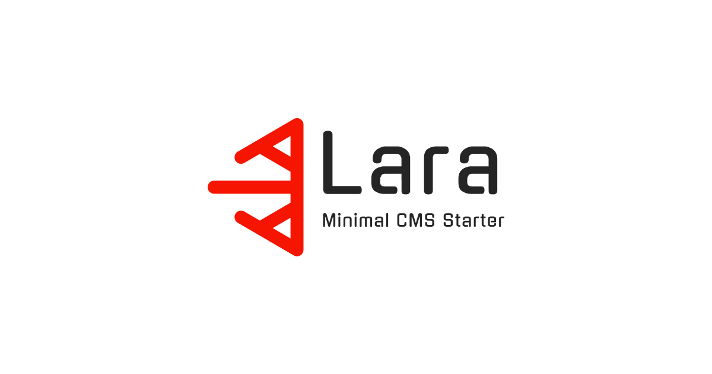

<!-- Developer: Sergey Nizhnik kroloburet@gmail.com -->



# Lara CMS

Lara is a simple and flexible Content Management System built on [Laravel](https://laravel.com/docs) and my minimalistic [UI framework](https://kroloburet.github.io/UI). It offers a powerful platform for creating multilingual, dynamic websites with a focus on ease of use and performance. Featuring customizable layouts and intuitive content management, Lara is ideal for developers and content creators alike.

## Installation

**Follow these steps to set up Lara**:

1. Clone the repository into your project folder:
   ```bash
   git clone --depth 1 https://github.com/kroloburet/Lara.git myProject && cd myProject
   ```

2. Install backend dependencies:
   Ensure PHP 8.2+ and Composer are installed, then run:
   ```bash
   composer install
   ```

3. Install frontend dependencies:
   Ensure Node.js is installed, then run:
   ```bash
   npm install
   ```

4. Configure environment:
   Copy `.env.example` to `.env` and set up your database credentials and other settings:
   ```bash
   cp .env.example .env
   ```

5. Generate application key:
   ```bash
   php artisan key:generate
   ```

6. Run migrations and seed:
   ```bash
   php artisan migrate --seed
   ```

7. Start the server and frontend in different terminal tabs:
   ```bash
   php artisan serve
   ```
   ```bash
   vite
   ```
   Access Lara at `http://localhost:8000`.

## Configure and Customization

**You can add or remove languages easily**:

1. Add or remove an item in `app.available_locales` in `config/app.php`, and check other config variables:
    ```php
        'locale' => env('APP_LOCALE', 'en'),
        'fallback_locale' => env('APP_FALLBACK_LOCALE', 'en'),
        'faker_locale' => env('APP_FAKER_LOCALE', 'en_US'),
        'available_locales' => [
            'EN' => 'en', // <- First item mast by a fallback app locale 
            'UA' => 'uk',
        ],
    ```
2. Copy the default language folder from `lang/` and translate all files if you want to add a new language.  
   **Note**: Ensure there are no records of the deleted language in the `content.locale` table.

## Deployment

1. 

2. Stop the local server and Vite in their tabs using `Ctrl + C`, then build frontend assets and clear optimization:
   ```bash
   vite build && php artisan optimize:clear
   ```

3. **Exclude the following paths** when deploying to the server:
   ```text
   .env
   .env.local
   .env.*.local
   .idea
   .vscode
   storage/logs
   storage/framework/cache
   storage/framework/sessions
   storage/framework/views
   storage/debugbar
   public/hot
   public/uploads
   public/sitemap.xml
   public/consumers.sitemap.xml
   public/materials.sitemap.xml
   tests
   phpunit.xml
   .phpunit.result.cache
   coverage
   *.log
   *.sqlite
   npm-debug.log*
   ```

4. **Prepare and upload the production `.env` file**:
    * On your local machine, create a production-ready `.env`:
      ```dotenv
      #######################################
      # Local (uncomment in local environment)
      #######################################
      #APP_ENV=local
      #APP_DEBUG=true
      #APP_URL=http://127.0.0.1:8000
      
      # Environment-dependent scripts
      #TINY_MCE_SCRIPTS="https://cdn.tiny.cloud/1/YOUR_TINY_MCE_API_KEY/tinymce/8/tinymce.min.js"
      #FLMNGR_API_KEY="YOUR_FLMNGR_API_KEY"
      #GOOGLE_MAP_SCRIPTS="//maps.googleapis.com/maps/api/js?key=YOUR_MAPS_API_KEY"
      
      #######################################
      # Production (uncomment in production)
      #######################################
      APP_ENV=production
      APP_DEBUG=false
      APP_URL=https://www.example.com
      
      # Environment-dependent scripts
      TINY_MCE_SCRIPTS="https://cdn.tiny.cloud/1/YOUR_TINY_MCE_API_KEY/tinymce/8/tinymce.min.js"
      FLMNGR_API_KEY="YOUR_FLMNGR_API_KEY"
      GOOGLE_MAP_SCRIPTS="//maps.googleapis.com/maps/api/js?key=YOUR_MAPS_API_KEY"
      ```
    * Upload the modified `.env` to the server.
    * After upload, **revert local `.env` back to local settings**.

5. Upload the project files to the server (via PhpStorm, rsync, FTP, etc.).

6. On the server, run:
   ```bash
   composer install --optimize-autoloader --no-dev
   # php artisan migrate --seed --force # If not migrate and seed
   php artisan config:cache
   php artisan route:cache
   php artisan view:cache
   ```

## License and Copyright

License: [MIT License](https://opensource.org/licenses/MIT).<br>
Copyright © Serhii Nyzhnyk. Contact: kroloburet@gmail.com<br>
Stand With Ukraine!<br>
<hr>
<a href="https://www.buymeacoffee.com/kroloburet"></a>
